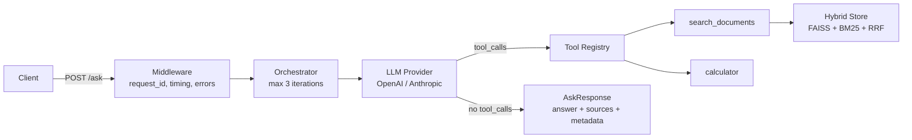

# agent-bench


Agentic RAG system with a 27-question evaluation harness, hybrid retrieval (FAISS + BM25 + RRF), tool use, and zero hallucinated citations — built from API primitives.

Built as a portfolio project demonstrating AI engineering depth: provider abstraction, evaluation infrastructure, production patterns (FastAPI, Docker, CI, structured logging).

`169 tests` | `27-question benchmark` | `2 providers` | `Docker ready` | `CI green`

## Benchmark Results

Evaluated on 27 hand-crafted questions over 16 FastAPI documentation files. Provider is swappable via one config field.

### Provider Comparison

| Metric | OpenAI gpt-4o-mini | Anthropic claude-haiku |
|--------|-------------------|----------------------|
| Retrieval P@5 | 0.70 | **0.74** |
| Retrieval R@5 | 0.83 | **0.84** |
| Keyword Hit Rate | 0.89 | **0.92** |
| Cost per query | **$0.0004** | $0.0007 |

### Full Metrics (V1 → V2)

| Metric | V1 (RRF only) | V2 (RRF + reranker) | Notes |
|--------|--------------|---------------------|-------|
| Retrieval P@5 | 0.70 | **0.74** | Cross-encoder reranking |
| Retrieval R@5 | 0.83 | **0.84** | Maintained |
| Keyword Hit Rate | 0.89 | **0.92** | Better answer coverage |
| Citation Accuracy | 1.00 | **1.00** | Zero hallucinated citations |
| Grounded Refusal | 0/5 | **Active** | Score threshold gate |
| Cost per query | $0.0004 | $0.0004 | gpt-4o-mini baseline |

[Full benchmark report](docs/benchmark_report.md) | [Provider comparison](docs/provider_comparison.md) | [Design decisions](DECISIONS.md)

### Framework Comparison: Custom vs. LangChain

To quantify what the custom orchestration layer buys over an off-the-shelf framework, the same retrieval stack is wired through a LangChain `AgentExecutor` baseline and evaluated on the identical 27-question golden dataset across both providers.

| Metric | Custom OpenAI | Custom Anthropic | LC OpenAI | LC Anthropic |
|--------|--------------|-----------------|-----------|-------------|
| P@5 | 0.70 | 0.74 | 0.64 | **0.75** |
| R@5 | 0.83 | **0.84** | **0.86** | **0.84** |
| KHR | 0.89 | **0.92** | 0.85 | 0.91 |
| Citation Acc | 1.00 | 1.00 | 1.00 | 1.00 |
| Latency p50 | **4,690 ms** | **4,690 ms** | 10,118 ms | 7,165 ms |

Retrieval quality is comparable across all four configurations (shared stack), but the custom pipeline runs at **~2x lower latency** by eliminating framework overhead. Zero hallucinated citations in all configurations. Full analysis: [comparison report](results/comparison_custom_vs_langchain.md).

## Live Demo

**https://nomearod-agentbench.hf.space** (Hugging Face Spaces — first request after idle may take ~30s for cold start)

```bash
# In-scope question (expect answer with sources)
curl -X POST https://nomearod-agentbench.hf.space/ask \
  -H "Content-Type: application/json" \
  -d '{"question": "How do I define a path parameter in FastAPI?"}'

# Out-of-scope question (expect grounded refusal)
curl -X POST https://nomearod-agentbench.hf.space/ask \
  -H "Content-Type: application/json" \
  -d '{"question": "How do I cook pasta?"}'

# Health check
curl https://nomearod-agentbench.hf.space/health
```

## Quick Start (Local)

```bash
make install    # Install dependencies
make ingest     # Chunk + embed 16 FastAPI docs into FAISS + BM25
make serve      # Start FastAPI server on :8000
```

```bash
curl -X POST http://localhost:8000/ask \
  -H "Content-Type: application/json" \
  -d '{"question": "How do I define a path parameter in FastAPI?"}'
```

### With Docker

```bash
OPENAI_API_KEY=sk-... docker-compose -f docker/docker-compose.yaml up --build
```

## Architecture



## What This Demonstrates

- **Agentic architecture**: Iterative tool-use loop — max 3 iterations with toolless fallback, no LangChain or LlamaIndex
- **RAG pipeline**: Hybrid retrieval via Reciprocal Rank Fusion (FAISS dense + BM25 sparse), two chunking strategies (recursive + fixed-size)
- **Provider abstraction**: Swap LLM backend via config. OpenAI + Anthropic implemented, MockProvider for deterministic tests
- **Evaluation infrastructure**: 27-question golden dataset with negative/out-of-scope cases, 8 deterministic metrics + 2 LLM-judge metrics, failure analysis
- **Production patterns**: FastAPI, Docker, CI/CD (GitHub Actions), HF Spaces deployment, rate limiting, provider retry with backoff, streaming (SSE), conversation sessions (SQLite), structlog, Pydantic v2, 145 deterministic tests

## API Endpoints

| Endpoint | Method | Description |
|----------|--------|-------------|
| `/ask` | POST | Ask a question, get answer with sources |
| `/ask/stream` | POST | SSE streaming (sources → chunks → done) |
| `/health` | GET | Store stats, provider status, uptime |
| `/metrics` | GET | Request count, latency p50/p95, cost |

### POST /ask

```json
{
  "question": "How do I define a path parameter in FastAPI?",
  "top_k": 5,
  "retrieval_strategy": "hybrid"
}
```

Response:

```json
{
  "answer": "Path parameters in FastAPI are defined using curly braces...",
  "sources": [{"source": "fastapi_path_params.md"}],
  "metadata": {
    "provider": "openai",
    "model": "gpt-4o-mini",
    "iterations": 2,
    "tools_used": ["search_documents"],
    "latency_ms": 1234.5,
    "token_usage": {"input_tokens": 500, "output_tokens": 150, "estimated_cost_usd": 0.0002},
    "request_id": "abc-123"
  }
}
```

## Evaluation

```bash
make evaluate-fast        # Deterministic metrics only (needs API key)
make evaluate-full        # + LLM-judge metrics (costs more)
make benchmark            # Generate markdown report from results
make evaluate-langchain   # Run LangChain baseline comparison
```

The golden dataset contains 27 hand-crafted questions:
- 19 retrieval: 8 easy (single chunk), 7 medium (multi-chunk), 4 hard (multi-source)
- 3 calculation: questions requiring the calculator tool
- 5 out-of-scope: questions testing grounded refusal (answer not in corpus)

## Testing

```bash
make test    # 169 deterministic tests, no API keys needed
make lint    # ruff + mypy
```

All tests use MockProvider + MockEmbeddingModel. No API keys. No model downloads. CI-safe.

## Design Decisions

See [DECISIONS.md](DECISIONS.md) for rationale on building from primitives, RRF over score normalization, negative evaluation cases, deterministic eval + optional LLM judge, and more.

## V1 → V2 Improvements

| Feature | V1 | V2 | Skill Demonstrated |
|---------|----|----|-------------------|
| Grounded refusal | 0/5 | Threshold gate | Trust & safety |
| Retrieval P@5 | 0.70 | 0.74 | Cross-encoder reranking |
| Provider support | OpenAI only | OpenAI + Anthropic | Multi-provider abstraction |
| Provider resilience | None | Retry + backoff | Error handling |
| Rate limiting | None | 10 RPM per IP | API hardening |
| Streaming | None | SSE (`/ask/stream`) | Async Python, real-time UX |
| Conversation memory | Stateless | SQLite sessions | State management |
| Cloud deployment | None | HF Spaces (Docker) | Docker → production |
| CI/CD | None | GitHub Actions | Automated quality gates |
| Tests | 97 | 145 | Comprehensive coverage |

See [DECISIONS.md](DECISIONS.md) for the reasoning behind each design choice.
