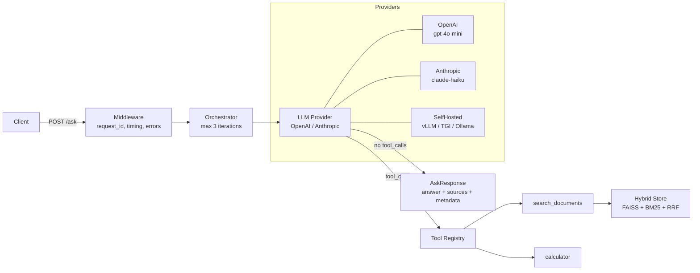

# agent-bench


Agentic knowledge retrieval system with evaluation benchmark. Custom orchestration pipeline + LangChain baseline, evaluated on the same 27-question golden dataset across 3 providers (OpenAI, Anthropic, self-hosted vLLM on Modal). Zero hallucinated citations in all API configurations.

`205 tests` · `3 providers` · `LangChain comparison` · `K8s + Terraform` · `CI`

## Benchmark Results

Evaluated on 27 hand-crafted questions over 16 FastAPI documentation files. Both pipelines use identical retrieval (FAISS + BM25 + RRF + cross-encoder reranker).

### Framework Comparison: Custom vs. LangChain

| Metric | Custom OpenAI | Custom Anthropic | LC OpenAI | LC Anthropic |
|--------|--------------|-----------------|-----------|-------------|
| P@5 | 0.70 | 0.74 | 0.64 | **0.75** |
| R@5 | 0.83 | **0.84** | **0.86** | **0.84** |
| KHR | 0.89 | **0.92** | 0.85 | 0.91 |
| Citation Acc | 1.00 | 1.00 | 1.00 | 1.00 |
| Cost/query | **$0.0004** | $0.0007 | $0.0003 | $0.0046 |

> **Key insight:** Retrieval quality is dominated by the shared retrieval stack (FAISS + BM25 + RRF + cross-encoder), not the orchestration layer. P@5 and R@5 vary by less than 0.12 across all four configurations. The main cost of framework abstraction is visible in LangChain's Anthropic path: 6.6x higher per-query cost with no retrieval improvement.

Citation accuracy is 1.00 everywhere, confirming the retrieval-grounded approach prevents hallucination regardless of framework or provider choice.

Full analysis: [comparison report](results/comparison_custom_vs_langchain.md)

### Provider Comparison (Custom Pipeline)

| Metric | OpenAI gpt-4o-mini | Anthropic claude-haiku | Self-hosted Mistral-7B |
|--------|-------------------|----------------------|----------------------|
| Retrieval P@5 | 0.70 | **0.74** | 0.05 |
| Retrieval R@5 | 0.83 | **0.84** | 0.05 |
| Keyword Hit Rate | 0.89 | **0.92** | 0.61 |
| Citation Acc | **1.00** | **1.00** | 0.14 |
| Latency p50 | 4,690 ms | 5,120 ms | 6,709 ms |
| Cost per query | **$0.0004** | $0.0007 | $0.0031 |

API providers are directly comparable (same config). The self-hosted row uses `max_iterations=1` and `top_k=3` (vs 3/5 for API) to fit Mistral-7B's 8K context window. Mistral-7B's context constraint forces single-iteration retrieval with fewer chunks, demonstrating that agentic tool-calling workflows have a practical model-size floor — a genuine architectural finding, not a system failure. See [provider comparison](docs/provider_comparison.md) for full analysis.

[Full benchmark report](docs/benchmark_report.md) | [Provider comparison](docs/provider_comparison.md) | [Design decisions](DECISIONS.md)

## Live Demo

**https://nomearod-agentbench.hf.space** (Hugging Face Spaces — first request after idle may take ~30s for cold start)

```bash
# In-scope question (expect answer with sources)
curl -X POST https://nomearod-agentbench.hf.space/ask \
  -H "Content-Type: application/json" \
  -d '{"question": "How do I define a path parameter in FastAPI?"}'

# Out-of-scope question (expect grounded refusal)
curl -X POST https://nomearod-agentbench.hf.space/ask \
  -H "Content-Type: application/json" \
  -d '{"question": "How do I cook pasta?"}'

# Health check
curl https://nomearod-agentbench.hf.space/health
```

## Quick Start (Local)

```bash
make install    # Install dependencies
make ingest     # Chunk + embed 16 FastAPI docs into FAISS + BM25
make serve      # Start FastAPI server on :8000
```

```bash
curl -X POST http://localhost:8000/ask \
  -H "Content-Type: application/json" \
  -d '{"question": "How do I define a path parameter in FastAPI?"}'
```

### With Docker

```bash
OPENAI_API_KEY=sk-... docker-compose -f docker/docker-compose.yaml up --build
```

### Self-Hosted LLM via Modal (no local GPU needed)

```bash
pip install -e ".[modal]"                                # Install Modal SDK
modal setup                                              # Authenticate with Modal
modal secret create huggingface-secret HF_TOKEN=hf_...   # HF token for model download
make modal-deploy                                        # Deploy vLLM on Modal A10G
export MODAL_VLLM_URL=https://your--agent-bench-vllm-serve.modal.run/v1
AGENT_BENCH_ENV=selfhosted_modal make serve              # Serve with self-hosted provider

# Run provider comparison (requires all provider API keys)
export OPENAI_API_KEY=sk-...
export ANTHROPIC_API_KEY=sk-ant-...
make benchmark-all

# Or run only the self-hosted provider
python modal/run_benchmark.py --base-url $MODAL_VLLM_URL --only selfhosted_modal
```

### Self-Hosted LLM via Docker Compose (requires local NVIDIA GPU)

```bash
docker compose -f docker/docker-compose.vllm.yml up --build
```

### Kubernetes (Helm)

```bash
make k8s-dev     # Dev: 1 replica, no HPA
make k8s-prod    # Prod: 3 replicas, HPA 2-8 pods
```

See [docs/k8s-local-setup.md](docs/k8s-local-setup.md) for minikube walkthrough.

## Architecture



## Engineering Scope

- **Agent design & evaluation**: Built two independent orchestration approaches (custom tool-calling loop + LangChain AgentExecutor) and evaluated both on identical metrics to quantify framework tradeoffs
- **Retrieval engineering**: Hybrid FAISS + BM25 with Reciprocal Rank Fusion, cross-encoder reranking, evaluated across 27 questions with P@5, R@5, citation accuracy
- **Infrastructure:** Kubernetes (Helm), Terraform (GCP/GKE), self-hosted LLM serving (vLLM on Modal + Docker Compose)
- **MLOps:** Provider comparison benchmark (API vs self-hosted, real measured data)
- **Production engineering**: FastAPI, Docker, CI/CD, structured logging, rate limiting, SSE streaming, conversation sessions, 205 deterministic tests with mock providers

<details><summary>API Reference</summary>

## API Endpoints

| Endpoint | Method | Description |
|----------|--------|-------------|
| `/ask` | POST | Ask a question, get answer with sources |
| `/ask/stream` | POST | SSE streaming (sources → chunks → done) |
| `/health` | GET | Store stats, provider status, uptime |
| `/metrics` | GET | Request count, latency p50/p95, cost (JSON) |
| `/metrics/prometheus` | GET | Prometheus text exposition format |

### POST /ask

```json
{
  "question": "How do I define a path parameter in FastAPI?",
  "top_k": 5,
  "retrieval_strategy": "hybrid"
}
```

Response:

```json
{
  "answer": "Path parameters in FastAPI are defined using curly braces...",
  "sources": [{"source": "fastapi_path_params.md"}],
  "metadata": {
    "provider": "openai",
    "model": "gpt-4o-mini",
    "iterations": 2,
    "tools_used": ["search_documents"],
    "latency_ms": 1234.5,
    "token_usage": {"input_tokens": 500, "output_tokens": 150, "estimated_cost_usd": 0.0002},
    "request_id": "abc-123"
  }
}
```

</details>

## Evaluation

```bash
make evaluate-fast        # Deterministic metrics only (needs API key)
make evaluate-full        # + LLM-judge metrics (costs more)
make benchmark            # Generate markdown report from results
make evaluate-langchain   # Run LangChain baseline comparison
```

The golden dataset contains 27 hand-crafted questions:
- 19 retrieval: 8 easy (single chunk), 7 medium (multi-chunk), 4 hard (multi-source)
- 3 calculation: questions requiring the calculator tool
- 5 out-of-scope: questions testing grounded refusal (answer not in corpus)

## Testing

```bash
make test    # 205 deterministic tests, no API keys needed
make lint    # ruff + mypy
```

All tests use MockProvider + MockEmbeddingModel. No API keys. No model downloads. CI-safe.

## Design Decisions

See [DECISIONS.md](DECISIONS.md) for rationale on building from primitives, RRF over score normalization, negative evaluation cases, deterministic eval + optional LLM judge, and more.

### V1 → V2 Evolution

| Feature | V1 | V2 |
|---------|----|----|
| Grounded refusal | 0/5 | Threshold gate |
| Retrieval P@5 | 0.70 | 0.74 (cross-encoder reranking) |
| Provider support | OpenAI only | OpenAI + Anthropic + self-hosted vLLM |
| Provider resilience | None | Retry + backoff |
| Rate limiting | None | 10 RPM per IP |
| Streaming | None | SSE (`/ask/stream`) |
| Conversation memory | Stateless | SQLite sessions |
| Infrastructure | Local only | Docker, K8s (Helm), Terraform (GKE), Modal |
| CI/CD | None | GitHub Actions |
| Tests | 97 | 205 |
