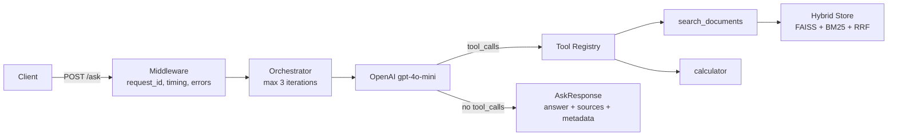

# agent-bench


Agentic RAG system with a 27-question evaluation harness, hybrid retrieval (FAISS + BM25 + RRF), tool use, and zero hallucinated citations — built from API primitives.

Built as a portfolio project demonstrating AI engineering depth: provider abstraction, evaluation infrastructure, production patterns (FastAPI, Docker, CI, structured logging).

`97 tests` | `25 commits` | `27-question benchmark` | `$0.0004/query` | `Docker ready`

## Benchmark Results

Evaluated on 27 hand-crafted questions using **gpt-4o-mini** ($0.0004/query) over 16 FastAPI documentation files. Provider is swappable via config — Anthropic Claude stubbed for V2.

| Metric | Value | Notes |
|--------|-------|-------|
| Citation Accuracy | **1.00** | Zero hallucinated citations |
| Keyword Hit Rate | **0.89** | Expected facts present in answer |
| Retrieval R@5 | **0.83** | Expected sources found in top 5 |
| Retrieval P@5 | **0.70** | Hybrid RRF (FAISS + BM25) |
| Calculator Accuracy | **2/3** | LLM sometimes skips tool use |
| Grounded Refusal | **0/5** | LLM never refuses — top V2 priority |
| Latency p50 | 4,690 ms | gpt-4o-mini, single iteration |
| Cost per query | $0.0004 | ~$0.01 for full 27-question eval |

[Full benchmark report with failure analysis](docs/benchmark_report.md) | [Design decisions](DECISIONS.md)

## Quick Start

```bash
make install    # Install dependencies
make ingest     # Chunk + embed 16 FastAPI docs into FAISS + BM25
make serve      # Start FastAPI server on :8000
```

```bash
curl -X POST http://localhost:8000/ask \
  -H "Content-Type: application/json" \
  -d '{"question": "How do I define a path parameter in FastAPI?"}'
```

### With Docker

```bash
OPENAI_API_KEY=sk-... docker-compose -f docker/docker-compose.yaml up --build
```

## Architecture



## What This Demonstrates

- **Agentic architecture**: Iterative tool-use loop — max 3 iterations with toolless fallback, no LangChain or LlamaIndex
- **RAG pipeline**: Hybrid retrieval via Reciprocal Rank Fusion (FAISS dense + BM25 sparse), two chunking strategies (recursive + fixed-size)
- **Provider abstraction**: Swap LLM backend via config. OpenAI implemented, Anthropic stubbed, MockProvider for deterministic tests
- **Evaluation infrastructure**: 27-question golden dataset with negative/out-of-scope cases, 8 deterministic metrics + 2 LLM-judge metrics, failure analysis
- **Production patterns**: FastAPI, Docker, structlog structured logging, Pydantic v2 validation, CI with 97 deterministic tests, request-level metrics

## API Endpoints

| Endpoint | Method | Description |
|----------|--------|-------------|
| `/ask` | POST | Ask a question, get answer with sources |
| `/health` | GET | Store stats, provider status, uptime |
| `/metrics` | GET | Request count, latency p50/p95, cost |

### POST /ask

```json
{
  "question": "How do I define a path parameter in FastAPI?",
  "top_k": 5,
  "retrieval_strategy": "hybrid"
}
```

Response:

```json
{
  "answer": "Path parameters in FastAPI are defined using curly braces...",
  "sources": [{"source": "fastapi_path_params.md"}],
  "metadata": {
    "provider": "openai",
    "model": "gpt-4o-mini",
    "iterations": 2,
    "tools_used": ["search_documents"],
    "latency_ms": 1234.5,
    "token_usage": {"input_tokens": 500, "output_tokens": 150, "estimated_cost_usd": 0.0002},
    "request_id": "abc-123"
  }
}
```

## Evaluation

```bash
make evaluate-fast   # Deterministic metrics only (needs API key)
make evaluate-full   # + LLM-judge metrics (costs more)
make benchmark       # Generate markdown report from results
```

The golden dataset contains 27 hand-crafted questions:
- 19 retrieval: 8 easy (single chunk), 7 medium (multi-chunk), 4 hard (multi-source)
- 3 calculation: questions requiring the calculator tool
- 5 out-of-scope: questions testing grounded refusal (answer not in corpus)

## Testing

```bash
make test    # 97 deterministic tests, no API keys needed
make lint    # ruff + mypy
```

All tests use MockProvider + MockEmbeddingModel. No API keys. No model downloads. CI-safe.

## Design Decisions

See [DECISIONS.md](DECISIONS.md) for rationale on building from primitives, RRF over score normalization, negative evaluation cases, deterministic eval + optional LLM judge, and more.

## V2 Roadmap

- [ ] Grounded refusal improvements (0/5 is the top priority)
- [ ] Cross-encoder reranking (feature-flagged, config ready)
- [ ] Second provider (Anthropic Claude)
- [ ] Streaming responses
- [ ] Conversation sessions with SQLite persistence

*Scope: Docker-local, CPU-only, single-domain V1.*
