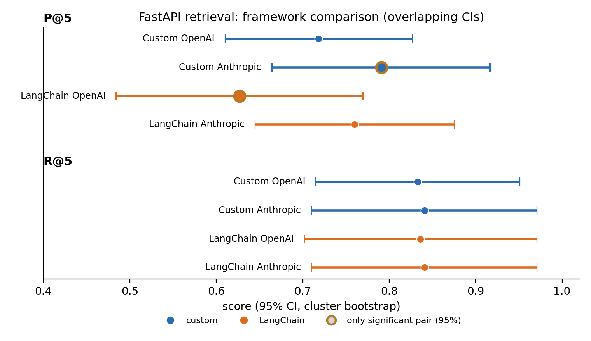
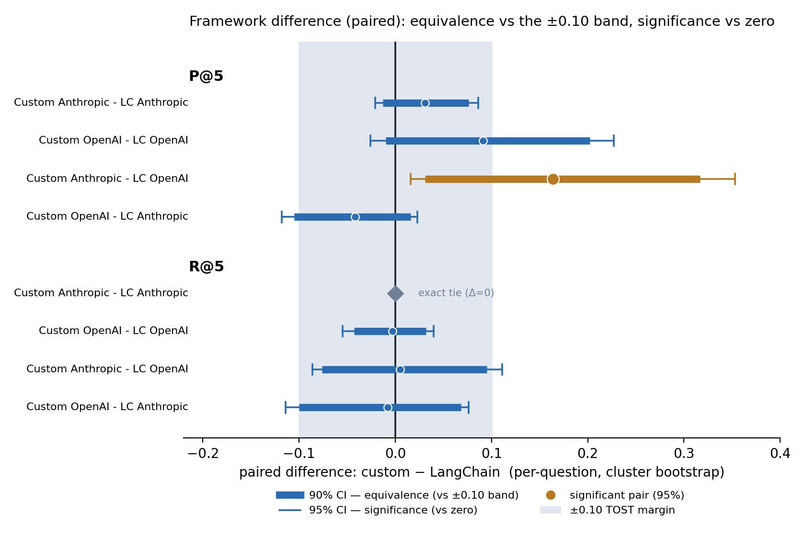
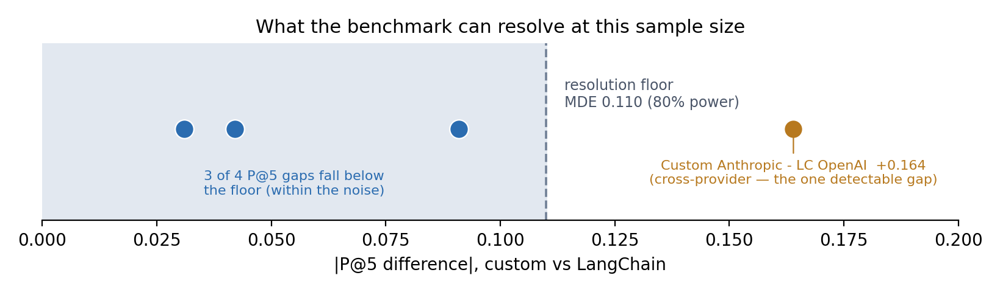
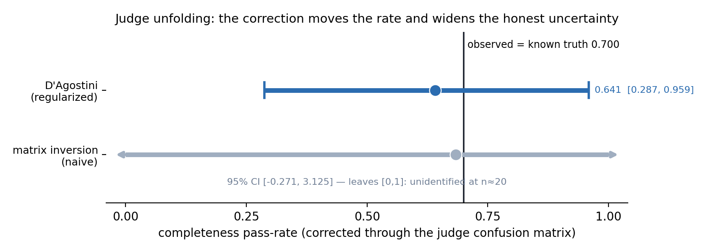
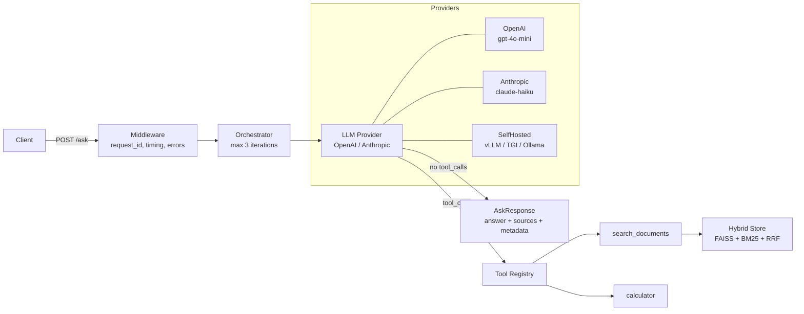
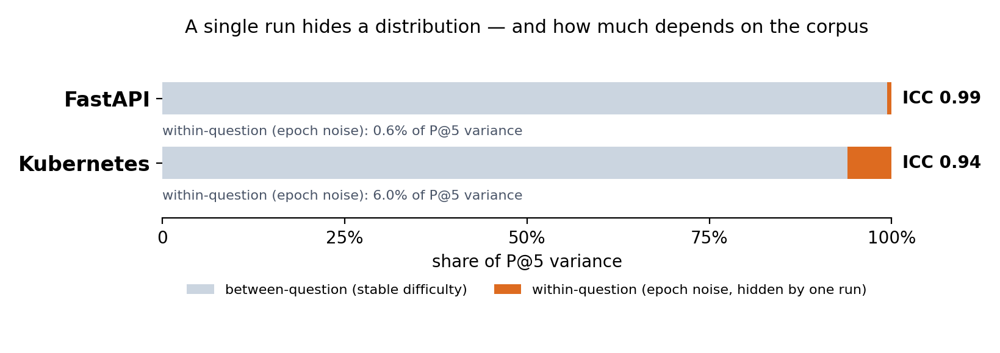

# agent-bench

**Measurement-rigorous evaluation for agentic RAG systems.**

A worked benchmark that turns agent scores into defensible claims: clustered confidence intervals, paired tests, TOST equivalence, power and minimum detectable effect, judge calibration, and replayable evidence. Demonstrated on two corpora, three providers, and a live API.


`726 tests` · `2 corpora` · `5-epoch eval campaign` · `clustered CIs` · `TOST` · `power/MDE` · `judge calibration` · `live HF demo`

**Run or inspect the evidence** (free, offline, no API keys):

```bash
make install         # dependencies
make test            # 713 deterministic tests, no API keys
make evaluate-stats  # regenerate docs/_generated/stats_report.md from results/long (offline)
```

## What this demonstrates

This is not a leaderboard. It is a measurement case study. The question it answers is not "which RAG framework wins" but what claims this benchmark can actually support, and its own headline finding is that most framework differences here are statistically indistinguishable, or equivalent within the band, with cost the only clean separator.

The discipline runs end to end: a score, then an interval, then a paired comparison, then power and minimum detectable effect, then a calibrated judge, then a defensible claim. The benchmark also reports what it cannot detect, not only what it can.

Provider-neutral by construction: the same harness runs OpenAI, Anthropic, and a self-hosted model on equal footing, and the comparison is built to be replayed rather than trusted.

## Benchmark Results

Evaluated on 27 hand-crafted questions over 16 FastAPI documentation files, 5 epochs per configuration. Both pipelines use identical retrieval (FAISS + BM25 + RRF + cross-encoder reranker). P@5, R@5, and citation accuracy are campaign results; intervals are cluster-bootstrapped 95 percent CIs and every figure below is pinned to [the generated statistics report](docs/_generated/stats_report.md) by `scripts/check_readme_stats.py`.

### Framework Comparison: Custom vs. LangChain

| Metric | Custom OpenAI | Custom Anthropic | LC OpenAI | LC Anthropic |
|--------|--------------|-----------------|-----------|-------------|
| P@5 | <!-- stats:fastapi_custom_openai_p_at_5_mean -->0.718<!-- /stats --> | <!-- stats:fastapi_custom_anthropic_p_at_5_mean -->0.791<!-- /stats --> | <!-- stats:fastapi_langchain_openai_p_at_5_mean -->0.627<!-- /stats --> | <!-- stats:fastapi_langchain_anthropic_p_at_5_mean -->0.760<!-- /stats --> |
| P@5 95% CI | <!-- stats:fastapi_custom_openai_p_at_5_ci -->[0.610, 0.827]<!-- /stats --> | <!-- stats:fastapi_custom_anthropic_p_at_5_ci -->[0.664, 0.917]<!-- /stats --> | <!-- stats:fastapi_langchain_openai_p_at_5_ci -->[0.484, 0.770]<!-- /stats --> | <!-- stats:fastapi_langchain_anthropic_p_at_5_ci -->[0.645, 0.875]<!-- /stats --> |
| R@5 | <!-- stats:fastapi_custom_openai_r_at_5_mean -->0.833<!-- /stats --> | <!-- stats:fastapi_custom_anthropic_r_at_5_mean -->0.841<!-- /stats --> | <!-- stats:fastapi_langchain_openai_r_at_5_mean -->0.836<!-- /stats --> | <!-- stats:fastapi_langchain_anthropic_r_at_5_mean -->0.841<!-- /stats --> |
| R@5 95% CI | <!-- stats:fastapi_custom_openai_r_at_5_ci -->[0.715, 0.951]<!-- /stats --> | <!-- stats:fastapi_custom_anthropic_r_at_5_ci -->[0.710, 0.971]<!-- /stats --> | <!-- stats:fastapi_langchain_openai_r_at_5_ci -->[0.702, 0.971]<!-- /stats --> | <!-- stats:fastapi_langchain_anthropic_r_at_5_ci -->[0.710, 0.971]<!-- /stats --> |
| KHR &dagger; | 0.89 | 0.92 | 0.85 | 0.91 |
| Citation Acc | 1.00 | 1.00 | 1.00 | 1.00 |
| Cost/query &dagger; | $0.0004 | $0.0007 | $0.0003 | $0.0046 |

&dagger; Single-run figures, not part of the 5-epoch campaign (KHR and cost were measured once; no interval).

No cell is bolded: of the eight framework-pair comparisons (four custom-vs-LangChain pairs across P@5 and R@5), exactly <!-- stats:fastapi_significant_pairs_95_count -->1<!-- /stats --> is statistically significant at 95 percent under the paired bootstrap.

Compared on absolute levels the four configurations barely separate, with the headline intervals overlapping broadly:



*The eight headline points with cluster-bootstrapped 95 percent CIs. They are wide and overlapping because between-question difficulty variance dominates the metric, the wrong lens for a framework comparison, not a negative result. That variance is shared across frameworks, so it cancels when the same questions are differenced pipeline-against-pipeline, which is exactly the comparison below.*

Framework-versus-framework is a **paired** question (the same questions through both pipelines), so it is answered on per-question differences, where the shared difficulty variance cancels and the comparison sharpens:



*Per-question paired differences (custom minus LangChain) with nested intervals: the thick 90 percent CI reads against the ±0.10 equivalence band (TOST), the thin 95 percent caps against zero (significance). Equivalence and significance are different questions asked at different confidence levels, and the plot draws both: most pairs' 90 percent intervals sit inside the band (equivalent), while only Custom Anthropic's P@5 over LangChain OpenAI (gold) excludes zero at 95 percent, and only just (lower bound +0.016) and only cross-provider. On one pair (R@5) the two levels disagree (equivalent at 90 percent, its 95 percent interval crossing the band), which the nested view shows rather than hides. Generated from [the stats report](docs/_generated/stats_report.md) by `scripts/make_plots.py` and pinned to it by a source-hash (CI fails on drift).*

> **Key insight: retrieval quality is set by the shared retrieval stack (FAISS + BM25 + RRF + cross-encoder), not the orchestration framework.** Holding the provider fixed, the custom and LangChain pipelines are statistically indistinguishable: for Anthropic the paired P@5 difference is equivalent within plus or minus <!-- stats:fastapi_custom_anthropic_vs_langchain_anthropic_p_at_5_support -->0.076<!-- /stats --> (TOST) and recall is identical (mean difference <!-- stats:fastapi_custom_anthropic_vs_langchain_anthropic_r_at_5_diff -->+0.000<!-- /stats -->); for OpenAI recall is equivalent within plus or minus <!-- stats:fastapi_custom_openai_vs_langchain_openai_r_at_5_support -->0.043<!-- /stats --> and the P@5 difference is not significant. The single significant comparison is Custom Anthropic's P@5 over LangChain OpenAI (mean difference <!-- stats:fastapi_custom_anthropic_vs_langchain_openai_p_at_5_diff -->+0.164<!-- /stats -->); that pair differs in model as well as framework, so it reflects provider choice, not the abstraction layer. The cost of framework abstraction shows up in price, not quality: LangChain's Anthropic path runs about 6.6x the per-query cost of the custom Anthropic pipeline (single-run cost).

Citation accuracy is 1.00 across all four configurations, but zero observed failures is not a zero rate: with the campaign's smallest included-question count (Custom OpenAI, n=<!-- stats:fastapi_custom_openai_citation_n -->19<!-- /stats -->), the exact Clopper-Pearson 95 percent upper bound on the per-question citation-failure rate is <!-- stats:fastapi_custom_openai_citation_upper -->0.146<!-- /stats --> (rule of three, 3/n = <!-- stats:fastapi_custom_openai_citation_rule_of_three -->0.158<!-- /stats -->). The campaign rules out a high hallucination rate, not a small one.

### What this benchmark can and cannot detect

At this sample size (5 epochs per configuration), the minimum detectable P@5 difference at 80 percent power is <!-- stats:fastapi_mde_p_at_5_80 -->0.110<!-- /stats --> (cluster bootstrap; normal approximation <!-- stats:fastapi_mde_p_at_5_80_normal -->0.136<!-- /stats -->). Three of the four framework pairs have P@5 gaps below that floor and cannot be distinguished from noise; only the +0.164 cross-provider gap clears it. Differences smaller than the MDE are out of this benchmark's resolution, which is the honest result, not a hedge.



*The four custom-vs-LangChain P@5 gaps against the <!-- stats:fastapi_mde_p_at_5_80 -->0.110<!-- /stats --> resolution floor (80 percent power): three sit within it (indistinguishable from noise at this n), and only the cross-provider <!-- stats:fastapi_custom_anthropic_vs_langchain_openai_p_at_5_diff -->+0.164<!-- /stats --> clears it. The floor nearly coincides with the 0.10 TOST equivalence margin, so "below resolution" and "within the equivalence band" are almost the same statement here. Pinned to the report by a source-hash.*

Full analysis: [comparison report](results/comparison_custom_vs_langchain.md)

### Provider Comparison (Custom Pipeline)

| Metric | OpenAI gpt-4o-mini | Anthropic claude-haiku | Self-hosted Mistral-7B |
|--------|-------------------|----------------------|----------------------|
| Retrieval P@5 | <!-- stats:fastapi_custom_openai_p_at_5_mean -->0.718<!-- /stats --> | <!-- stats:fastapi_custom_anthropic_p_at_5_mean -->0.791<!-- /stats --> | 0.05 &Dagger; |
| Retrieval P@5 95% CI | <!-- stats:fastapi_custom_openai_p_at_5_ci -->[0.610, 0.827]<!-- /stats --> | <!-- stats:fastapi_custom_anthropic_p_at_5_ci -->[0.664, 0.917]<!-- /stats --> | n/a |
| Retrieval R@5 | <!-- stats:fastapi_custom_openai_r_at_5_mean -->0.833<!-- /stats --> | <!-- stats:fastapi_custom_anthropic_r_at_5_mean -->0.841<!-- /stats --> | 0.05 &Dagger; |
| Retrieval R@5 95% CI | <!-- stats:fastapi_custom_openai_r_at_5_ci -->[0.715, 0.951]<!-- /stats --> | <!-- stats:fastapi_custom_anthropic_r_at_5_ci -->[0.710, 0.971]<!-- /stats --> | n/a |
| Keyword Hit Rate &dagger; | 0.89 | 0.92 | 0.61 |
| Citation Acc | 1.00 | 1.00 | 0.14 &Dagger; |
| Latency p50 &dagger; | 4,690 ms | 5,120 ms | 6,709 ms |
| Cost per query &dagger; | $0.0004 | $0.0007 | $0.0031 |

&dagger; Single-run figures, not part of the 5-epoch campaign. &Dagger; Self-hosted Mistral-7B was measured in a separate single-run benchmark with `max_iterations=1` and `top_k=3` (vs 3/5 for API) to fit its 8K context window; it is not part of the campaign and has no interval.

The API providers are directly comparable (same config). Mistral-7B's context constraint forces single-iteration retrieval with fewer chunks, showing that agentic tool-calling workflows have a practical model-size floor: a genuine architectural finding, not a system failure. See [provider comparison](docs/provider_comparison.md) for full analysis.

[Full benchmark report](docs/benchmark_report.md) | [Statistics report](docs/_generated/stats_report.md) | [Provider comparison](docs/provider_comparison.md) | [Judge calibration](docs/judge-design.md) | [Design decisions](DECISIONS.md)

## LLM-as-Judge Evaluation

The deterministic metrics above answer *did retrieval find the right chunks*. They cannot answer *did the agent's prose stay grounded in those chunks*. `make evaluate-full` adds an offline LLM-judge layer for that; it is not in the `/ask` request path.

Three per-dimension judges score each in-scope answer against an anchored discrete rubric:

- **Groundedness**: every claim is entailed by a retrieved snippet. Scope is strict: the *snippets*, not the corpus they were drawn from. This strict scope is what makes the "zero hallucinated citations" claim measurable.
- **Relevance**: the answer addresses the question (the only dimension scored on out-of-scope items).
- **Completeness**: the answer covers the reference answer's points, paraphrase allowed.

Judges support an explicit abstain verdict and rubric permutation as a variance control. A 2-judge κ-weighted jury (Anthropic Haiku + OpenAI gpt-4o-mini) aggregates verdicts; weights come from each judge's per-dimension agreement with hand labels.

### Calibration

The layer is calibrated against a 30-item hand-labeled set spanning both corpora. `make calibrate` scores 6 ablation rows (rubric anchors, CoT, abstain, jury, permutation) and regenerates [`docs/_generated/kappa_table.md`](docs/_generated/kappa_table.md). Headline agreement at v1.1: groundedness AC1 = 1.000, relevance AC1 = 1.000, completeness κ = 0.416.

Agreement is reported with Gwet's AC1 on prevalence-skewed dimensions and Cohen's κ where the gold distribution supports it. The calibration surfaced a κ-as-weight degeneracy (under an intervention that shifts a judge's marginals, κ can fall even as accuracy rises), which AC1 reads correctly. The full methodology (rubric-drift stress-test against a frontier model, the v1 jury weight-pipeline bug, two distinct small-model failure modes, and the v1.2 fix-list) is in **[docs/judge-design.md](docs/judge-design.md)**.

A v3.2 extension borrows confusion-matrix unfolding from experimental physics to ask what the judge's own scoring noise does to a reported pass-rate, and whether it can be corrected:



*Correcting the completeness pass-rate through the judge's confusion matrix moves it down and widens the honest uncertainty. The regularized D'Agostini interval is wide but contains the known truth, so the propagation is calibrated; it is not a claim that unfolding rescued a biased measurement (the canary confusion here is the identity). The naive matrix-inversion interval leaves [0,1] entirely, the precise signal that the correction is unidentified at this sample size. The figure and its numbers come from [docs/judge-design.md](docs/judge-design.md) section 1.9, and the figure is pinned to that table by a source-hash.*

## Live Demo

The live API is the front door into the evidence: the same system that produced the numbers above is the one you can query here.

**https://nomearod-agentbench.hf.space** (Hugging Face Spaces, cold wake on idle takes ~2 minutes, warm queries respond in ~5s; see [DECISIONS.md](DECISIONS.md) for the bounded measurement and v1.1 contingency)

```bash
# In-scope question (expect answer with sources)
curl -X POST https://nomearod-agentbench.hf.space/ask \
  -H "Content-Type: application/json" \
  -d '{"question": "How do I define a path parameter in FastAPI?"}'

# Out-of-scope question (expect grounded refusal)
curl -X POST https://nomearod-agentbench.hf.space/ask \
  -H "Content-Type: application/json" \
  -d '{"question": "How do I cook pasta?"}'

# Health check
curl https://nomearod-agentbench.hf.space/health
```

## Architecture



## Engineering Scope

- **Agent design & evaluation**: Built two independent orchestration approaches (custom tool-calling loop + LangChain AgentExecutor) and evaluated both on identical metrics to quantify framework tradeoffs
- **Retrieval engineering**: Hybrid FAISS + BM25 with Reciprocal Rank Fusion, cross-encoder reranking, evaluated across 27 questions with P@5, R@5, citation accuracy
- **Infrastructure:** Kubernetes (Helm), Terraform (GCP/GKE), self-hosted LLM serving (vLLM on Modal + Docker Compose)
- **MLOps:** Provider comparison benchmark (API vs self-hosted, real measured data)
- **Security (detection & redaction)**: Two-tier prompt injection detection (heuristic regex + DeBERTa classifier), PII redaction on retrieved context, output validation gate (PII leakage, URL hallucination, blocklist)
- **Security (audit & compliance)**: Append-only JSONL audit trail, HMAC-SHA256 IP hashing (GDPR-aligned), log rotation, config-driven security with Literal-constrained enums
- **Production engineering**: FastAPI, Docker, CI/CD, structured logging, rate limiting, SSE streaming, conversation sessions, 713 deterministic tests with mock providers

## Security (production hardening)

One capability in the production stack, included to show the same honest-degradation discipline the measurement work uses: injection detection runs heuristic-only without a GPU and classifier-backed when one is available, PII redaction and output validation gate every request, and the result is audit-logged either way. Degraded mode is declared, not silent.

```
User Input
    │
    ▼
┌──────────────────────┐
│  Injection Detection  │  Tier 1: heuristic regex (local, <1ms)
│  (pre-retrieval)      │  Tier 2: DeBERTa classifier (Modal GPU)
└──────────┬───────────┘
           │ safe
           ▼
┌──────────────────────┐
│  Retrieval            │  FAISS + BM25 + RRF + cross-encoder
│  (existing pipeline)  │
└──────────┬───────────┘
           │
           ▼
┌──────────────────────┐
│  PII Redaction        │  regex (always) + spaCy NER (optional)
│  (post-retrieval)     │
└──────────┬───────────┘
           │
           ▼
┌──────────────────────┐
│  LLM Generation       │  OpenAI / Anthropic / vLLM (Modal)
│  (existing pipeline)  │
└──────────┬───────────┘
           │
           ▼
┌──────────────────────┐
│  Output Validation    │  PII leakage + URL check + blocklist
│  (post-generation)    │
└──────────┬───────────┘
           │
           ▼
┌──────────────────────┐
│  Audit Log            │  JSONL, HMAC-hashed IPs, rotated
│  (every request)      │
└──────────┬───────────┘
           │
           ▼
       Response
```

**Injection detection** uses a two-tier architecture: heuristic regex rules catch common patterns (<1ms), and an optional DeBERTa classifier on Modal GPU provides high-confidence classification. Without GPU, the system runs heuristic-only: honest degradation, not silent failure.

**PII redaction** runs regex patterns for high-risk types (SSN, credit card, email, phone, IP address) on every retrieved chunk before it enters the LLM context window. Optional spaCy NER adds PERSON/ORG detection for deployments that need it.

**Output validation** catches PII leakage (LLM reconstructing redacted data), URL hallucination (URLs not in retrieved chunks), and blocklisted patterns (system prompt fragments, API keys).

**Audit logging** writes one structured JSON record per request to an append-only JSONL file. Client IPs are HMAC-SHA256 hashed with a server secret (`AUDIT_HMAC_KEY` env var) so they are irreversible even against offline enumeration of the IPv4 address space. Logs include injection verdicts, output validation results, and response metadata.

```bash
# Query the audit log with jq
jq 'select(.injection_verdict.safe == false)' logs/audit.jsonl
jq 'select(.session_id == "abc123")' logs/audit.jsonl
```

This is an application-layer security pipeline; it does not replace network-level security, authentication, or infrastructure hardening.

See [SECURITY.md](SECURITY.md) for the OWASP LLM Top 10 (2025) mapping. See [DECISIONS.md](DECISIONS.md) for why we chose two-tier detection over three, regex-only PII by default, JSONL over SQLite for audit, and HMAC over plain SHA-256 for IP hashing.

<details><summary>Security configuration</summary>

All security settings live in `configs/default.yaml` under the `security` key and map to Pydantic models with Literal-constrained enums:

```yaml
security:
  injection:
    enabled: true
    action: block          # block | warn | flag
    tiers: [heuristic, classifier]
    classifier_url: ""     # Modal endpoint URL when using Tier 2
  pii:
    enabled: true
    mode: redact           # redact | detect_only | passthrough
    redact_patterns: [EMAIL, PHONE, SSN, CREDIT_CARD, IP_ADDRESS]
    use_ner: false         # requires: pip install -e ".[ner]"
    ner_entities: [PERSON]
  output:
    enabled: true
    pii_check: true
    url_check: true
    blocklist: []          # regex patterns to block in output
  audit:
    enabled: true
    path: logs/audit.jsonl
    max_size_mb: 100
    rotate: true
```

</details>

## Quick Start (Local)

```bash
make install    # Install dependencies
make ingest     # Chunk + embed 16 FastAPI docs into FAISS + BM25
make serve      # Start FastAPI server on :8000
```

```bash
curl -X POST http://localhost:8000/ask \
  -H "Content-Type: application/json" \
  -d '{"question": "How do I define a path parameter in FastAPI?"}'
```

### With Docker

```bash
OPENAI_API_KEY=sk-... docker-compose -f docker/docker-compose.yaml up --build
```

### Self-Hosted LLM via Modal (no local GPU needed)

```bash
pip install -e ".[modal]"                                # Install Modal SDK
modal setup                                              # Authenticate with Modal
modal secret create huggingface-secret HF_TOKEN=hf_...   # HF token for model download
make modal-deploy                                        # Deploy vLLM on Modal A10G
export MODAL_VLLM_URL=https://your--agent-bench-vllm-serve.modal.run/v1
AGENT_BENCH_ENV=selfhosted_modal make serve              # Serve with self-hosted provider

# Run provider comparison (requires all provider API keys)
export OPENAI_API_KEY=sk-...
export ANTHROPIC_API_KEY=sk-ant-...
make benchmark-all

# Or run only the self-hosted provider
python modal/run_benchmark.py --base-url $MODAL_VLLM_URL --only selfhosted_modal
```

### Self-Hosted LLM via Docker Compose (requires local NVIDIA GPU)

```bash
docker compose -f docker/docker-compose.vllm.yml up --build
```

### Kubernetes (Helm)

```bash
make k8s-dev     # Dev: 1 replica, no HPA
make k8s-prod    # Prod: 3 replicas, HPA 2-8 pods
```

See [docs/k8s-local-setup.md](docs/k8s-local-setup.md) for minikube walkthrough.

## Methodology Notes

**Refusal-gate thresholds under LLM-driven query formulation are non-deterministic.** During the Kubernetes 25-question threshold sweep (see [DECISIONS.md](DECISIONS.md) for the full write-up), an unexpected result surfaced: raising `refusal_threshold` from 0.015 to 0.025 produced _fewer_ retrieval-gate trips than 0.020, even though higher thresholds should be strictly more restrictive. Root cause: the orchestrator issues LLM-written queries to the search tool, so the same golden-dataset question produces different retrieval max_scores run-to-run, depending on what query the LLM chose to write. The sweep's "broken retrieval" count at each threshold is therefore not a fixed number but a distribution. The practical implication is that refusal-gate calibration in RAG systems with LLM-driven query formulation requires measuring run-to-run variance and sitting below the noisy floor with margin, not just picking the highest value that passes a one-shot sweep. The K8s threshold is pinned at 0.015, the empirical pilot floor, validated against the full 25-question set with the variance finding explicitly accounted for.

The v3.1 statistics layer turns this run-to-run variance into a measured quantity rather than an anecdote. On the FastAPI P@5 campaign, the variance decomposition gives an intraclass correlation of <!-- stats:fastapi_icc_p_at_5 -->0.99<!-- /stats -->: almost all of the metric's variance is stable between-question difficulty, with epoch-to-epoch noise near zero. That is the FastAPI-side counterpart to the K8s refusal-gate finding above: a metric reported from a single run hides a distribution, and the fix is to measure across epochs and cluster by question, which is exactly what produces the 95 percent intervals in the Benchmark Results tables.



*How much a single run hides depends on the corpus. FastAPI's metric is near-deterministic (within-question epoch noise is <!-- stats:fastapi_within_question_pct -->0.6<!-- /stats --> percent of its variance, ICC <!-- stats:fastapi_icc_p_at_5 -->0.99<!-- /stats -->), while Kubernetes carries ten times as much (<!-- stats:k8s_within_question_pct -->6.0<!-- /stats --> percent, ICC <!-- stats:k8s_icc_p_at_5 -->0.94<!-- /stats -->), because its agentic retrieval issues LLM-written queries that vary run-to-run. Same statistics layer, different amount of hidden distribution. Pinned to the report by a source-hash.*

## Evaluation

```bash
make evaluate-fast        # Deterministic metrics only (needs API key)
make evaluate-full        # + LLM-judge metrics (costs more)
make benchmark            # Generate markdown report from results
make evaluate-langchain   # Run LangChain baseline comparison
```

The golden dataset contains 27 hand-crafted FastAPI questions (19 retrieval · 3 calculation · 5 out-of-scope) and 25 hand-crafted Kubernetes questions across the CRAG 8-type taxonomy (6 simple · 4 simple-with-condition · 4 comparison · 6 multi-hop · 4 false-premise · 1 set). Questions are authored with index-aligned `source_snippets`/`source_chunk_ids` so every expected answer can be traced back to a verbatim string in the ingested store: no LLM-judged ground truth, no paraphrase fuzz.

<details><summary>API Reference</summary>

## API Endpoints

| Endpoint | Method | Description |
|----------|--------|-------------|
| `/ask` | POST | Ask a question, get answer with sources |
| `/ask/stream` | POST | SSE streaming (sources → chunks → done) |
| `/health` | GET | Store stats, provider status, uptime |
| `/metrics` | GET | Request count, latency p50/p95, cost (JSON) |
| `/metrics/prometheus` | GET | Prometheus text exposition format |

### POST /ask

```json
{
  "question": "How do I define a path parameter in FastAPI?",
  "top_k": 5,
  "retrieval_strategy": "hybrid"
}
```

Response:

```json
{
  "answer": "Path parameters in FastAPI are defined using curly braces...",
  "sources": [{"source": "fastapi_path_params.md"}],
  "metadata": {
    "provider": "openai",
    "model": "gpt-4o-mini",
    "iterations": 2,
    "tools_used": ["search_documents"],
    "latency_ms": 1234.5,
    "token_usage": {"input_tokens": 500, "output_tokens": 150, "estimated_cost_usd": 0.0002},
    "request_id": "abc-123"
  }
}
```

</details>

## Testing

```bash
make test    # 713 deterministic tests, no API keys needed
make lint    # ruff + mypy
```

All tests use MockProvider + MockEmbeddingModel. No API keys. No model downloads. CI-safe.

### Targets that cost money

These Make targets call paid LLM APIs. Run locally; they are excluded from CI.

| Target | Requires API key | Approximate cost | What it produces |
|---|---|---|---|
| `make evaluate-full` | OpenAI or Anthropic | $0.01-0.10 per run | Full-corpus harness run with L1 + L2 judges; results in `results/{run_label}.json`. Cost scales with item count × judge dimensions: in-scope items get all 3 (groundedness + relevance + completeness), out-of-scope items get relevance only (~$0.0001/item). |
| `make calibrate` | Anthropic + OpenAI | ~$2 per full run | Generates frozen system outputs, scores all 6 ablation rows, builds `docs/_generated/kappa_table.md` |
| `make evaluate-judges` | Anthropic + OpenAI | ~$1 per run | Re-runs the 6 rows against existing system outputs (no regeneration) |
| `make evaluate-langchain` | OpenAI or Anthropic | $0.01-0.05 per run | LangChain baseline harness for the comparison report |

Set keys via `OPENAI_API_KEY` and `ANTHROPIC_API_KEY` environment variables. CI does not have these (test job uses `MockProvider`).

## Design Decisions

See [DECISIONS.md](DECISIONS.md) for rationale on building from primitives, RRF over score normalization, negative evaluation cases, deterministic eval + optional LLM judge, security architecture tradeoffs, and more.

### V1 → V2 → V3 Evolution

| Feature | V1 | V2 | V3 |
|---------|----|----|-----|
| Grounded refusal | 0/5 | Threshold gate | Threshold gate |
| Retrieval P@5 | 0.70 | 0.74 (cross-encoder) | 0.74 |
| Provider support | OpenAI only | OpenAI + Anthropic + vLLM | Same |
| Streaming | None | SSE (`/ask/stream`) | SSE |
| Infrastructure | Local only | Docker, K8s, Terraform, Modal | Same |
| **Injection detection** | None | None | Two-tier (heuristic + DeBERTa) |
| **PII redaction** | None | None | Regex + optional NER |
| **Output validation** | None | None | PII leakage + URL + blocklist |
| **Audit logging** | None | None | JSONL, HMAC-hashed IPs |
| **LLM-as-judge** | None | Single-call faithfulness/correctness | Per-dimension judges + κ-calibrated jury |
| Tests | 97 | 205 | 528 |

P@5 figures in this evolution table are single-run historical milestones (the V1 to V2 cross-encoder gain); the current campaign means with 95 percent intervals are in the Benchmark Results tables above.

## Where this goes next

The same measurement discipline is applied in `eu-ai-act-internal-control`, a provider-side EU AI Act conformity-engineering proof asset. agent-bench demonstrates the evaluation statistics; the conformity repo shows how those claims become evidence registers, findings, documentation inserts, and monitoring metrics.

The statistics layer is intentionally harness-agnostic and currently ships inside agent-bench; extraction waits until the conformity repo becomes the second consumer.
